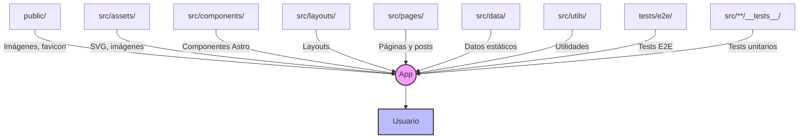

# Astro Starter Kit: Basics

```sh
npm create astro@latest -- --template basics
```

[](https://stackblitz.com/github/withastro/astro/tree/latest/examples/basics)
[](https://codesandbox.io/p/sandbox/github/withastro/astro/tree/latest/examples/basics)
[](https://codespaces.new/withastro/astro?devcontainer_path=.devcontainer/basics/devcontainer.json)

> 🧑‍🚀 **Seasoned astronaut?** Delete this file. Have fun!


## �️ Estructura de la aplicación

```text
/ (raíz del proyecto)
├── public/                # Archivos públicos (imágenes, favicon, etc.)
├── src/
│   ├── assets/            # Recursos gráficos (SVG, imágenes)
│   ├── components/        # Componentes Astro reutilizables
│   │   └── __tests__/     # Tests de componentes
│   ├── data/              # Datos estáticos (posts.js)
│   ├── layouts/           # Plantillas de layout para páginas
│   ├── pages/             # Páginas del sitio (enlaces, index, prompts, sobre-mi, posts)
│   │   ├── posts/         # Páginas y posts individuales (MDX/MD)
│   │   └── __tests__/     # Tests de páginas
│   └── utils/             # Utilidades y helpers
│       └── __tests__/     # Tests de utilidades
├── tests/
│   └── e2e/               # Tests end-to-end con Playwright
├── playwright.config.ts   # Configuración de Playwright
├── vitest.config.ts       # Configuración de Vitest
├── tsconfig.json          # Configuración de TypeScript
├── package.json           # Dependencias y scripts
├── astro.config.mjs       # Configuración de Astro
└── README.md              # Documentación
```


### Diagrama visual (Mermaid)

> **Tip:** Puedes exportar el diagrama como imagen (PNG o SVG) desde la vista previa Mermaid en VS Code y guardarlo como `public/estructura-app-diagrama.png`.

#### Vista previa como imagen


Puedes visualizar el diagrama con soporte Mermaid en VS Code o usando [Mermaid Live Editor](https://mermaid.live/):



El archivo fuente del diagrama está en `estructura-app-diagrama.mmd`.

Inside of your Astro project, you'll see the following folders and files:

```text
/
├── public/
│   └── favicon.svg
├── src/
│   ├── layouts/
│   │   └── Layout.astro
│   └── pages/
│       └── index.astro
└── package.json
```

To learn more about the folder structure of an Astro project, refer to [our guide on project structure](https://docs.astro.build/en/basics/project-structure/).

## 🧞 Commands

All commands are run from the root of the project, from a terminal:

| Command                   | Action                                           |
| :------------------------ | :----------------------------------------------- |
| `npm install`             | Installs dependencies                            |
| `npm run dev`             | Starts local dev server at `localhost:4321`      |
| `npm run build`           | Build your production site to `./dist/`          |
| `npm run preview`         | Preview your build locally, before deploying     |
| `npm run astro ...`       | Run CLI commands like `astro add`, `astro check` |
| `npm run astro -- --help` | Get help using the Astro CLI                     |

## 👀 Want to learn more?

Feel free to check [our documentation](https://docs.astro.build) or jump into our [Discord server](https://astro.build/chat).
